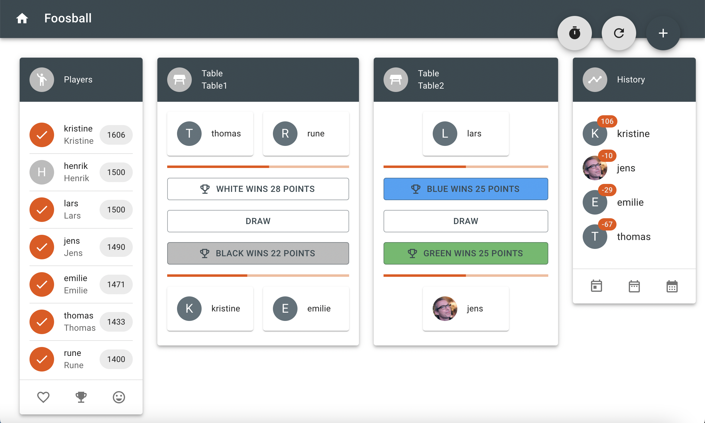

# Foosball tournament applications

[](https://github.com/jensborch/go-foosball/actions/workflows/go.yml)
[](https://github.com/jensborch/go-foosball/actions/workflows/js.yml)
[](https://goreportcard.com/report/github.com/jensborch/go-foosball)
[](https://codecov.io/gh/jensborch/go-foosball)

Go-foosball is an application to manage your foosball tournaments. It supports multiple tournaments, and you can easily add players and tables. Each players receives a rating based on a chess like rating system (Elo).




The application is using a REST service back-end written in Go and a front-end created written TypeScript and React.

## Build

Build the back-end using:

```sh
make build
```

or

```sh
go build -o go-foosball
```

[Go](https://go.dev/) must be installed.

Build the front-end using:

```sh
make client
```

or

```sh
cd client
yarn build
```

[Node.js](https://nodejs.org/) version 14 or above and [Yarn](https://yarnpkg.com/) must be installed.

## Test

Test the back-end using:

```sh
make test
```

or

```sh
go test -cover ./...
```

Test the front-end using:

```sh
cd client
yarn test
```

## Run

Start the application using:

```sh
./go-foosball
```

or on Windows:

```bat
go-foosball.exe
```

The GUI can then be accessed using [http://localhost:8080/]

The front-end will be embed in the back-end executable when build using:

```sh
make client build
```

but back-end and front-end can also run separately. To only start the front-end use:

```sh
cd client
yarn start
```

## Swagger

```sh
make swagger
```

or

```sh
$(go env GOPATH)/bin/swag init
```

Swagger can be viewed using [http://localhost:8080/swagger/index.html]